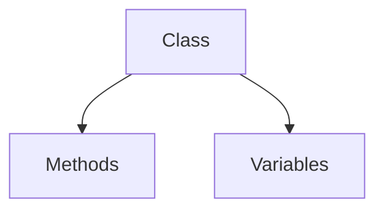
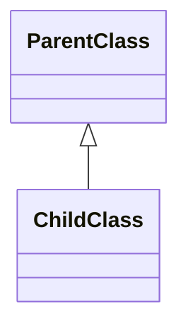
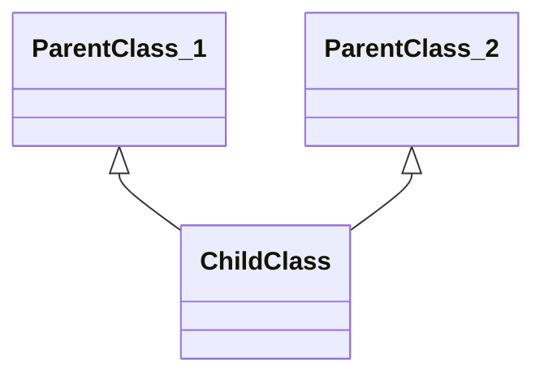
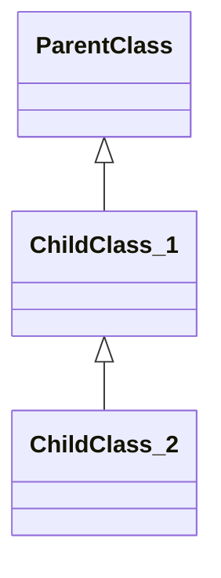
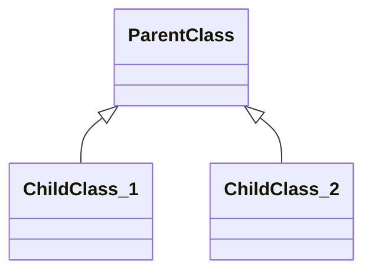
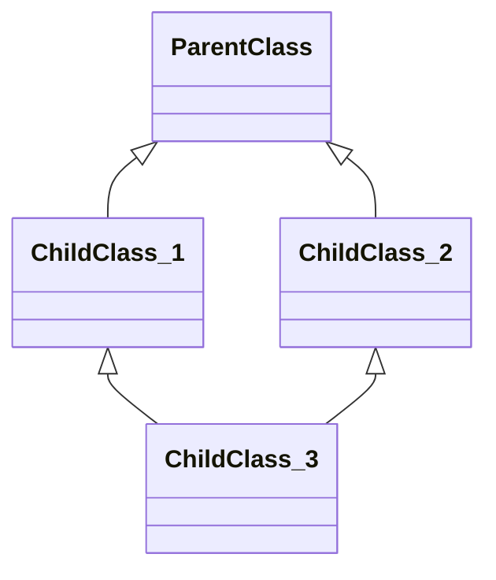

## ✨ PIAIC Lecture 12: Sunday Session Recap by Warda Rehman
Welcome to the Twelfth session of the PIAIC Certified Cloud Native AI Program! Object-Oriented Programming (OOP) is a powerful way to structure code, making it more reusable and scalable. Instead of writing code around functions, OOP focuses on **objects**, which represent real-world entities like a car, a person, or even a bank account. Each object has **attributes** (data) and **methods** (functions) that define its behavior.  

In this session, we explored the core concepts of OOP in Python, including **encapsulation, inheritance, polymorphism, and abstraction**. We also learned how to define classes, create objects, use special methods, and work with constructors and destructors. Let’s break it down step by step! 🚀  

---

## **🧩 Understanding Object-Oriented Programming (OOP)**
OOP is a programming style that focuses on objects rather than just functions and procedures. In Python, everything is an object!  

### **🔹 Key Terms in OOP**
- **Class** → A blueprint for creating objects  
- **Object** → An instance of a class with specific data and behavior  
- **Attributes** → Variables that hold an object’s data  
- **Methods** → Functions that define what an object can do  

---

## **🔑 Four Pillars of OOP**
### **1️⃣ Encapsulation 🔒 (Data Protection)**
Encapsulation means **hiding** data within a class and only allowing controlled access to it. This keeps our code secure and well-organized.  


#### **Example: Private and Public Attributes**
```python
class Car:
    def __init__(self, brand, model):
        self.brand = brand      # Public attribute
        self.__model = model    # Private attribute

    def get_model(self):
        return self.__model  # Accessing private attribute using a method

car1 = Car("Toyota", "Corolla")
print(car1.brand)        #  Allowed
print(car1.get_model())  #  Allowed via method
print(car1.__model)      #  Not Allowed (AttributeError)
```
👉 **Why use encapsulation?** To protect sensitive data and prevent direct modification.

---

### **2️⃣ Inheritance 🧬 (Code Reusability)**
Inheritance allows a new class (**child class**) to inherit methods and attributes from an existing class (**parent class**).  

## **Simple Inheritance**



A **child class** inherits from a **single parent class**.

## Code Example
```python
class Parent:
    def show(self):
        print("This is the Parent class.")

class Child(Parent):
    def display(self):
        print("This is the Child class.")

# Creating an object of the Child class
obj = Child()
obj.show()   # Inherited from Parent
obj.display()  # Own method
```

## Explanation

- `Parent` class has a method `show()`.
- `Child` class **inherits** from `Parent`, so it gets access to `show()`.
- The `Child` class has its own method `display()`.
- The `obj` (object of `Child` class) can call both `show()` and `display()`.

## Output

```
This is the Parent class.
This is the Child class.
```

---
## **Multiple Inheritance**

A **child class** inherits from **more than one parent class**.

## Code Example

```python
class Father:
    def father_info(self):
        print("This is the Father class.")

class Mother:
    def mother_info(self):
        print("This is the Mother class.")

class Child(Father, Mother):
    def child_info(self):
        print("This is the Child class.")

# Creating an object of the Child class
obj = Child()
obj.father_info()  # Inherited from Father
obj.mother_info()  # Inherited from Mother
obj.child_info()   # Own method
```

## Explanation

- `Father` class has a method `father_info()`.
- `Mother` class has a method `mother_info()`.
- `Child` class **inherits from both** `Father` and `Mother`, gaining access to both methods.
- The `Child` class also defines its own method, `child_info()`.
- The `obj` (object of `Child` class) can call all three methods.

## Output

```
This is the Father class.
This is the Mother class.
This is the Child class.
```

---

## **Multi-Level Inheritance**



A **child class** inherits from a **parent class**, and another child **inherits from that child**.

## Code Example

```python
class Grandparent:
    def grandparent_info(self):
        print("This is the Grandparent class.")

class Parent(Grandparent):
    def parent_info(self):
        print("This is the Parent class.")

class Child(Parent):
    def child_info(self):
        print("This is the Child class.")

# Creating an object of the Child class
obj = Child()
obj.grandparent_info()  # Inherited from Grandparent
obj.parent_info()       # Inherited from Parent
obj.child_info()        # Own method
```

## Explanation

- `Grandparent` class has a method `grandparent_info()`.
- `Parent` class **inherits** from `Grandparent` and adds `parent_info()`.
- `Child` class **inherits** from `Parent` and adds `child_info()`.
- The `Child` class now has access to methods from **both** `Parent` and `Grandparent`.

## Output

```
This is the Grandparent class.
This is the Parent class.
This is the Child class.
```

---

## **Hierarchical Inheritance**


In **hierarchical inheritance**, a single **parent class** has **multiple child classes**.

## Code Example

```python
class Parent:
    def parent_info(self):
        print("This is the Parent class.")

class Child1(Parent):
    def child1_info(self):
        print("This is the First Child class.")

class Child2(Parent):
    def child2_info(self):
        print("This is the Second Child class.")

# Creating objects of both child classes
obj1 = Child1()
obj2 = Child2()

obj1.parent_info()  # Inherited from Parent
obj1.child1_info()  # Own method

obj2.parent_info()  # Inherited from Parent
obj2.child2_info()  # Own method
```

## Explanation

- **`Parent` class** contains `parent_info()` method.
- **`Child1` and `Child2`** both inherit from `Parent`, gaining access to `parent_info()`.
- **Each child class** has its own unique method (`child1_info()` and `child2_info()`).
- **Objects of `Child1` and `Child2`** can access the parent’s method along with their own.

## Output

```
This is the Parent class.
This is the First Child class.
This is the Parent class.
This is the Second Child class.
```

---
## **Hybrid Inheritance**

**Hybrid Inheritance** is a combination of two or more types of inheritance in Python.

## Code Example

```python
class A:
    def method_A(self):
        print("This is class A.")

class B(A):  # Single Inheritance
    def method_B(self):
        print("This is class B.")

class C(A):  # Hierarchical Inheritance
    def method_C(self):
        print("This is class C.")

class D(B, C):  # Multiple Inheritance
    def method_D(self):
        print("This is class D.")

# Creating an object of class D
obj = D()
obj.method_A()  # Inherited from A
obj.method_B()  # Inherited from B
obj.method_C()  # Inherited from C
obj.method_D()  # Own method
```

## Explanation

- **Class `A`** is the base class.
- **Class `B`** inherits from `A` (**Single Inheritance**).
- **Class `C`** also inherits from `A` (**Hierarchical Inheritance**).
- **Class `D`** inherits from both `B` and `C` (**Multiple Inheritance**), making this a **Hybrid Inheritance** structure.
- The **object of class `D`** can access methods from all parent classes due to **method resolution order (MRO)**.

## Output

```
This is class A.
This is class B.
This is class C.
This is class D.
```

---

👉 **Why use inheritance?** To avoid rewriting code and create a logical hierarchy between classes.

---

### **3️⃣ Polymorphism 🎭 (Same Function, Different Behavior)**
Polymorphism allows different objects to use the **same method name** but behave differently.  

#### **Example: Different Classes with the Same Method**
```python
class Bird:
    def sound(self):
        return "Chirp"

class Dog:
    def sound(self):
        return "Bark"

def make_sound(animal):
    print(animal.sound())

make_sound(Bird())  # Output: Chirp
make_sound(Dog())   # Output: Bark
```
👉 **Why use polymorphism?** It makes code more flexible and scalable.

---

### **4️⃣ Abstraction 🎩 (Hiding Complexity)**
Abstraction means **hiding the details** and showing only the important parts of an object. This makes the code easier to use and understand.  

#### **Example: Abstract Class**
```python
from abc import ABC, abstractmethod

class Animal(ABC):  # Abstract Class
    @abstractmethod
    def sound(self):
        pass  # Must be implemented by subclasses

class Cat(Animal):
    def sound(self):
        return "Meow"

print(Cat().sound())  # Output: Meow
```
👉 **Why use abstraction?** To keep the code simple and focus only on what’s necessary.

---

## **🛠️ Creating Classes and Objects**
Classes help us **define a template** for objects. Objects are then created from these templates.  

#### **Example: Defining a Class and Creating an Object**
```python
class Person:
    def __init__(self, name, age):
        self.name = name
        self.age = age

    def greet(self):
        return f"Hello, my name is {self.name}."

person1 = Person("Alice", 30)
print(person1.greet())  # Output: Hello, my name is Alice.
```
👉 **Why use classes and objects?** They help organize and structure code in a better way.

---

## **🛠️ Constructors and Destructors**
- **Constructor (`__init__`)** → Runs automatically when an object is created  
- **Destructor (`__del__`)** → Runs when an object is deleted  

#### **Example: Constructor and Destructor in Action**
```python
class MyClass:
    def __init__(self):
        print("Object created!")

    def __del__(self):
        print("Object deleted!")

obj = MyClass()  # Object is created
del obj          # Object is deleted
```
👉 **Why use them?** To handle setup and cleanup tasks automatically.

---

## **🎩 Magic (Dunder) Methods**
Magic methods (also called **dunder methods**) allow objects to interact with built-in Python operations.

#### **Example: `__str__()` for Custom String Representation**
```python
class Book:
    def __init__(self, title, pages):
        self.title = title
        self.pages = pages

    def __str__(self):
        return f"{self.title}, {self.pages} pages"

book = Book("Python Guide", 300)
print(book)  # Output: Python Guide, 300 pages
```
👉 **Why use magic methods?** They make objects work like built-in data types.

---

## Wrap-Up
In this session, we explored the fundamentals of Object-Oriented Programming in Python, covering **classes, objects, encapsulation, inheritance, polymorphism, abstraction, constructors, destructors, and magic methods**. By mastering these concepts, you can write more efficient and modular code that scales well.  

 **🚀Write less, do more, let objects handle the work!**
